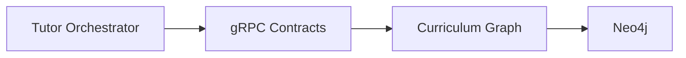
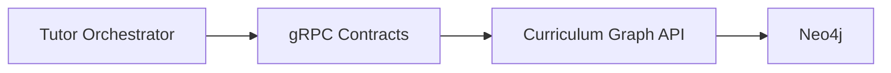

# Architectural Responsibility Boundaries

## Overview

The AIGORA architecture separates knowledge topology management from pedagogical decision-making.

This separation creates:

* clearer ownership boundaries
* reduced architectural coupling
* deterministic orchestration governance
* bounded context isolation
* long-term scalability
* infrastructure encapsulation
* improved maintainability

The architecture is divided into two primary bounded contexts:

```text
Curriculum Graph
=
Knowledge Topology Service

Tutor Orchestrator
=
Pedagogical Decision Engine
```

Each bounded context owns an isolated architectural responsibility.

---

# Architectural Principle

The architecture intentionally separates:

* curriculum topology ownership
* pedagogical orchestration ownership

The Curriculum Graph owns curriculum structure.

The Tutor Orchestrator owns pedagogical reasoning and learning progression decisions.

This separation prevents pedagogical logic from leaking into topology services while preserving deterministic orchestration governance.

---

# Bounded Context Separation

The architecture is organized into isolated bounded contexts.



The Tutor Orchestrator consumes topology capabilities through explicit service contracts without direct access to graph persistence or traversal infrastructure.

---

# Curriculum Graph Responsibilities

## Purpose

The Curriculum Graph is responsible for representing and exposing the structure of knowledge.

It owns curriculum topology and dependency relationships between learning concepts.

The Curriculum Graph acts as the authoritative topology provider for orchestration systems.

---

## Responsibilities

The Curriculum Graph owns:

* prerequisite relationships
* dependency modeling
* curriculum topology
* node relationships
* graph traversal
* learning path topology
* difficulty hierarchy
* semantic concept relationships
* curriculum versioning
* deterministic topology retrieval

The Curriculum Graph must preserve deterministic graph traversal and reproducible topology resolution.

---

## Examples

Examples of Curriculum Graph capabilities include:

* `GetAdjacentLearningNodes`
* `GetPrerequisites`
* `GetNodeDependencies`
* `GetGraphVersion`

These capabilities expose topology behavior through explicit service contracts.

---

## Non-Responsibilities

The Curriculum Graph does not own:

* pedagogical decisions
* student progression
* ranking strategies
* mastery evaluation
* remediation policies
* regression handling
* orchestration sequencing
* candidate prioritization
* pedagogical auditability

Pedagogical reasoning belongs exclusively to the Tutor Orchestrator.

---

# Tutor Orchestrator Responsibilities

## Purpose

The Tutor Orchestrator is responsible for deterministic pedagogical decision-making.

It coordinates learning progression using:

* orchestration engines
* deterministic policies
* ranking strategies
* selection strategies
* orchestration sequencing

The Tutor Orchestrator acts as the pedagogical reasoning layer of the platform.

---

## Responsibilities

The Tutor Orchestrator owns:

* learning progression
* candidate selection
* eligibility evaluation
* mastery validation
* remediation handling
* regression handling
* ranking strategies
* orchestration policies
* deterministic sequencing
* pedagogical auditability
* orchestration traceability
* deterministic decision-making

The Tutor Orchestrator preserves orchestration governance and pedagogical consistency.

---

## Examples

Examples of Tutor Orchestrator responsibilities include:

* Should the student progress?
* Should remediation happen?
* Which candidate node should win?
* Should regression occur?
* Which pedagogical policy should apply?
* Which learning node should be selected next?

These decisions belong exclusively to the orchestration layer.

---

## Non-Responsibilities

The Tutor Orchestrator does not own:

* graph persistence
* Neo4j traversal
* graph storage implementation
* graph schema management
* curriculum topology ownership
* topology persistence infrastructure

Topology ownership belongs exclusively to the Curriculum Graph.

---

# Interaction Boundary

The Tutor Orchestrator interacts with the Curriculum Graph only through explicit service contracts.

The orchestration layer consumes graph capabilities without direct knowledge of:

* graph persistence
* graph traversal implementation
* Neo4j infrastructure
* topology storage concerns



This separation prevents infrastructure leakage and preserves bounded context isolation.

---

# Architectural Benefits

The separation between topology ownership and pedagogical orchestration provides multiple architectural benefits.

## Benefits

* reduced coupling
* clearer ownership boundaries
* independent scalability
* deterministic orchestration governance
* improved auditability
* easier maintainability
* infrastructure encapsulation
* bounded context isolation
* future extensibility toward adaptive orchestration

These benefits improve long-term architectural evolution and operational maintainability.

---

# Deterministic Governance

The architecture preserves deterministic orchestration governance across all orchestration stages.

The Tutor Orchestrator guarantees:

* deterministic orchestration sequencing
* deterministic ranking
* deterministic selection
* reproducible pedagogical decisions
* stable orchestration behavior
* orchestration auditability

The Curriculum Graph guarantees:

* deterministic topology retrieval
* deterministic graph traversal
* stable dependency resolution
* graph version traceability

Together, these guarantees preserve reproducible educational orchestration.

---

# Architectural Constraints

The architecture enforces strict bounded context constraints.

| Constraint                   | Description                                                         |
| ---------------------------- | ------------------------------------------------------------------- |
| Topology ownership isolation | Curriculum topology belongs exclusively to the Curriculum Graph     |
| Pedagogical isolation        | Pedagogical reasoning belongs exclusively to the Tutor Orchestrator |
| Infrastructure encapsulation | Neo4j remains isolated behind service contracts                     |
| Contract isolation           | External systems consume topology only through APIs                 |
| Governance preservation      | Orchestration decisions must remain deterministic and auditable     |

These constraints preserve long-term architectural consistency.

---

# Design Principle

The Curriculum Graph owns:

```text
knowledge topology
```

The Tutor Orchestrator owns:

```text
pedagogical decision-making
```

Together, these bounded contexts establish the deterministic educational orchestration foundation inside AIGORA.

---

# Future Evolution

Future platform evolution may progressively introduce:

* adaptive orchestration
* heuristic-assisted ranking
* semantic topology retrieval
* distributed graph traversal
* event-driven orchestration
* hybrid orchestration models

while preserving:

* bounded context isolation
* deterministic governance
* orchestration auditability
* topology ownership consistency
* architectural traceability

The separation between topology ownership and pedagogical orchestration establishes the architectural foundation for future scalable orchestration evolution.
