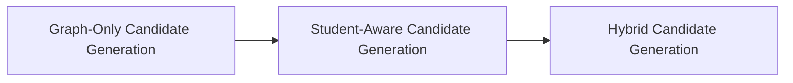
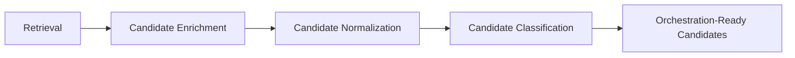

# Candidate Generation Model

## Overview

This document defines the Candidate Generation architecture used by the AIGORA Tutor Orchestrator.

Candidate Generation is responsible for transforming retrieved learning nodes into orchestration-ready candidates that can later participate in:

- policy evaluation
- deterministic ranking
- orchestration selection
- pedagogical decision-making

The architecture is intentionally deterministic-first and evolves incrementally toward student-aware and hybrid candidate generation capabilities.

---

# Architectural Principle

Candidate Generation transforms retrieved learning nodes into orchestration-ready candidates.

The orchestration architecture evolves incrementally across multiple maturity stages:



Initial implementations prioritize topology-driven deterministic candidate generation.

Student-aware and hybrid orchestration capabilities are progressively introduced as the Student Model matures and richer pedagogical signals become available.

---

# Candidate Generation Summary

| # | Category | Description | Student Model Required | Status |
|---|---|---|---|---|
| 1 | [Graph-Only Candidate Generation](#1-graph-only-candidate-generation) | Uses only curriculum topology and graph structure | No | Implemented First |
| 2 | [Student-Aware Candidate Generation](#2-student-aware-candidate-generation) | Uses student mastery and learning progression signals | Yes | Planned for Future Iterations |
| 3 | [Hybrid Candidate Generation](#3-hybrid-candidate-generation) | Combines graph topology with student learning state | Yes | Planned for Advanced Orchestration |

---

# High-Level Candidate Generation Flow

The candidate generation pipeline transforms retrieved curriculum nodes into orchestration-ready pedagogical candidates.

Each stage incrementally enriches, normalizes, and classifies retrieved nodes while preserving deterministic orchestration guarantees and bounded orchestration responsibilities.



---

# 1. Graph-Only Candidate Generation

Graph-only candidate generation strategies depend exclusively on curriculum topology and graph structure.

These strategies do not require Student Model integration.

## Responsibilities

- topology-valid candidate generation
- traversal-based candidate enrichment
- prerequisite-aware candidate preparation
- deterministic candidate normalization
- orchestration candidate classification

## Example Metadata

- `nodeId`
- `graphVersion`
- `retrievalDepth`
- `dependencyDistance`
- `prerequisiteCount`
- `difficulty`
- `source = graph_retrieval`

## Characteristics

| Property | Description |
|---|---|
| Dependency Scope | Curriculum Graph only |
| Student State Dependency | No |
| Determinism Level | Fully deterministic |
| Execution Complexity | Low |
| Initial Adoption Priority | Highest |

## Status

```text
IMPLEMENTED FIRST
```

Graph-only candidate generation establishes the deterministic foundation of orchestration candidate preparation.

---

# 2. Student-Aware Candidate Generation

Student-aware candidate generation strategies depend on student learning state and progression signals.

These strategies require Student Model integration.

## Responsibilities

- mastery-aware candidate generation
- progression-aware candidate enrichment
- remediation candidate generation
- review candidate preparation
- learning progression classification

## Example Metadata

- `studentMastery`
- `alreadyCompleted`
- `recentMistakes`
- `reviewStatus`
- `progressionStatus`

## Characteristics

| Property | Description |
|---|---|
| Dependency Scope | Student Model |
| Student State Dependency | Yes |
| Determinism Level | Deterministic |
| Execution Complexity | Medium |
| Initial Adoption Priority | Incremental |

## Status

```text
PLANNED FOR FUTURE ITERATIONS
```

Student-aware candidate generation progressively introduces pedagogical personalization while preserving deterministic orchestration guarantees.

---

# 3. Hybrid Candidate Generation

Hybrid candidate generation combines curriculum topology with student learning state.

These strategies represent advanced orchestration capabilities.

## Responsibilities

- adaptive candidate enrichment
- personalized progression preparation
- remediation-aware orchestration generation
- context-aware candidate prioritization
- adaptive orchestration classification

## Example Metadata

- `topologyValidButPedagogicallyRisky`
- `remediationCandidate`
- `progressionCandidate`
- `reviewCandidate`
- `adaptiveCandidateReason`

## Characteristics

| Property | Description |
|---|---|
| Dependency Scope | Curriculum Graph + Student Model |
| Student State Dependency | Yes |
| Determinism Level | Hybrid deterministic orchestration |
| Execution Complexity | High |
| Initial Adoption Priority | Advanced orchestration phase |

## Status

```text
PLANNED FOR ADVANCED ORCHESTRATION
```

Hybrid candidate generation represents the long-term evolution of adaptive pedagogical orchestration inside AIGORA.

---

# Candidate Lifecycle

Candidates evolve through deterministic orchestration stages.

```text
Retrieved Node
↓
Candidate Enrichment
↓
Metadata Normalization
↓
Candidate Classification
↓
Policy Evaluation
↓
Ranking
↓
Selection
```

Candidate Generation does not perform pedagogical decisions directly.

Its responsibility is to construct stable orchestration-ready candidate representations.

---

# Candidate Metadata

Candidate metadata provides deterministic orchestration signals used by later orchestration stages.

## Topology Signals

- dependency distance
- prerequisite count
- traversal depth
- graph version
- curriculum adjacency

## Pedagogical Signals

- mastery stability
- remediation need
- review requirement
- progression readiness
- recent learning instability

Candidate metadata must remain deterministic, reproducible, and auditable.

---

# Deterministic Guarantees

Global deterministic governance is documented in:

- [Deterministic Governance](deterministic-governance.md)


The Candidate Generation architecture preserves the following guarantees:

- same input produces the same candidate set
- deterministic metadata generation
- deterministic candidate normalization
- deterministic candidate ordering
- graph version traceability
- stable orchestration candidate preparation

These guarantees ensure reproducible orchestration behavior.

---

# Architectural Constraints

The Candidate Generation layer enforces strict orchestration boundaries.

| Constraint | Description |
|---|---|
| Curriculum Graph ownership | Curriculum Graph owns topology retrieval |
| Candidate isolation | Candidate Generation does not perform final pedagogical decisions |
| Policy isolation | Candidate Generation cannot bypass policy evaluation |
| Infrastructure isolation | Candidate Generation remains independent from infrastructure concerns |
| Deterministic governance | Candidate preparation must remain reproducible |

These constraints preserve orchestration consistency and bounded context isolation.

---

# Future Evolution

Future orchestration evolution is centralized in:

- [Orchestration Roadmap](orchestration-roadmap.md)

This document focuses only on the subsystem behavior described above.
