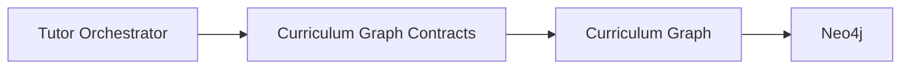

# Curriculum Graph Contracts

## Overview

This document defines the formal service contracts exposed by the AIGORA Curriculum Graph API.

The Curriculum Graph owns:

* curriculum topology retrieval
* graph traversal
* prerequisite resolution
* dependency expansion
* curriculum relationship modeling
* graph version management

The Curriculum Graph acts as the authoritative topology provider for orchestration and learning progression systems.

---

# Architectural Principle

The Curriculum Graph exposes topology capabilities through explicit service contracts while preserving:

* bounded context isolation
* infrastructure encapsulation
* deterministic topology retrieval
* stable contract evolution
* graph ownership consistency

Graph traversal behavior must remain encapsulated behind explicit service boundaries.

The Curriculum Graph owns topology.

External systems consume topology through contracts.

---

# Service Responsibilities

The Curriculum Graph owns deterministic curriculum topology operations.

## Responsibilities

* graph traversal
* adjacency resolution
* prerequisite resolution
* dependency expansion
* curriculum topology retrieval
* graph versioning
* topology consistency validation

The Curriculum Graph must not perform pedagogical orchestration decisions.

---

# gRPC Contract Architecture

The Curriculum Graph exposes topology capabilities through explicit gRPC contracts.



The gRPC contract layer isolates orchestration systems from graph infrastructure details and persistence concerns.

---

# gRPC Contracts

| # | Method                                                  | Purpose                           | Request               | Response                |
| - | ------------------------------------------------------- | --------------------------------- | --------------------- | ----------------------- |
| 1 | [GetAdjacentLearningNodes](#1-getadjacentlearningnodes) | Retrieve adjacent learning nodes  | `NodeRequest`         | `AdjacentNodesResponse` |
| 2 | [GetPrerequisites](#2-getprerequisites)                 | Retrieve prerequisite nodes       | `NodeRequest`         | `PrerequisiteResponse`  |
| 3 | [GetNodeDependencies](#3-getnodedependencies)           | Retrieve dependency relationships | `NodeRequest`         | `DependencyResponse`    |
| 4 | [GetGraphVersion](#4-getgraphversion)                   | Retrieve graph snapshot version   | `GraphVersionRequest` | `GraphVersionResponse`  |
| 5 | [TraverseLearningPath](#5-traverselearningpath)         | Execute graph traversal           | `TraversalRequest`    | `TraversalResponse`     |

---

# 1. GetAdjacentLearningNodes

Retrieves topology-adjacent learning nodes for a given curriculum node.

## Responsibilities

* adjacency retrieval
* topology expansion
* deterministic traversal ordering
* topology continuity preservation

## Request

```text
NodeRequest
```

## Response

```text
AdjacentNodesResponse
```

---

# 2. GetPrerequisites

Retrieves prerequisite nodes required before progression to a target learning node.

## Responsibilities

* prerequisite resolution
* dependency validation
* topology dependency enforcement

## Request

```text
NodeRequest
```

## Response

```text
PrerequisiteResponse
```

---

# 3. GetNodeDependencies

Retrieves dependency relationships associated with a curriculum node.

## Responsibilities

* dependency expansion
* dependency traversal
* topology relationship retrieval

## Request

```text
NodeRequest
```

## Response

```text
DependencyResponse
```

---

# 4. GetGraphVersion

Retrieves the active graph snapshot version.

## Responsibilities

* graph snapshot retrieval
* topology reproducibility
* orchestration traceability
* deterministic graph version resolution

## Request

```text
GraphVersionRequest
```

## Response

```text
GraphVersionResponse
```

---

# 5. TraverseLearningPath

Executes deterministic graph traversal operations.

## Responsibilities

* curriculum traversal
* path expansion
* traversal sequencing
* topology path resolution

## Request

```text
TraversalRequest
```

## Response

```text
TraversalResponse
```

---

# Topology APIs

The Curriculum Graph exposes multiple topology-oriented APIs.

| API Category       | Responsibility                            |
| ------------------ | ----------------------------------------- |
| Adjacency APIs     | Resolve topology-adjacent learning nodes  |
| Prerequisite APIs  | Resolve prerequisite dependencies         |
| Dependency APIs    | Resolve topology dependency relationships |
| Traversal APIs     | Execute deterministic graph traversal     |
| Graph Version APIs | Resolve graph snapshot versions           |

These APIs expose curriculum topology capabilities while preserving infrastructure encapsulation.

---

# Interaction Boundaries

The Curriculum Graph enforces strict bounded context isolation.

| Boundary                     | Constraint                                                      |
| ---------------------------- | --------------------------------------------------------------- |
| Tutor Orchestrator isolation | Tutor Orchestrator never queries Neo4j directly                 |
| Pedagogical isolation        | Curriculum Graph never performs pedagogical decisions           |
| Traversal encapsulation      | Graph traversal remains isolated behind service contracts       |
| Topology ownership           | Curriculum topology belongs exclusively to the Curriculum Graph |
| Infrastructure isolation     | External systems never access graph persistence directly        |

These boundaries preserve architectural governance and ownership consistency.

---

# Versioning Contracts

The Curriculum Graph preserves deterministic graph versioning guarantees.

## Versioning Responsibilities

* graph snapshot traceability
* graph version reproducibility
* stable contract evolution
* deterministic graph retrieval
* orchestration trace reconstruction

Every orchestration decision must remain traceable to a deterministic graph snapshot version.

---

# Deterministic Guarantees

The Curriculum Graph preserves the following guarantees:

* deterministic topology retrieval
* stable graph traversal ordering
* deterministic dependency resolution
* reproducible graph traversal
* graph version traceability
* stable contract evolution

The same topology request must always produce the same topology response for a given graph version.

---

# Architectural Constraints

The Curriculum Graph enforces strict topology governance constraints.

| Constraint                   | Description                                             |
| ---------------------------- | ------------------------------------------------------- |
| Topology ownership           | Curriculum Graph exclusively owns curriculum topology   |
| Infrastructure encapsulation | Neo4j remains isolated behind service contracts         |
| Deterministic retrieval      | Graph traversal must remain reproducible                |
| Contract isolation           | External systems depend only on contracts               |
| Orchestration isolation      | Curriculum Graph does not perform pedagogical reasoning |

These constraints preserve long-term topology governance and bounded context isolation.

---

# Future Evolution

Future topology capabilities may progressively introduce:

* distributed graph traversal
* topology indexing
* semantic graph retrieval
* adaptive traversal optimization
* graph caching strategies
* traversal performance optimization
* graph partitioning strategies

while preserving:

* contract stability
* deterministic topology retrieval
* graph version traceability
* bounded context isolation
* orchestration reproducibility

The Curriculum Graph contracts establish the topology foundation for future distributed orchestration evolution.
