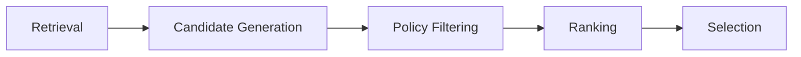
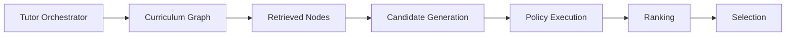
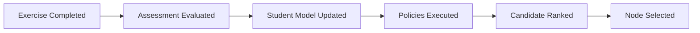

# Decision Engine Architecture

## Overview

This document defines the Decision Engine architecture used by the AIGORA Tutor Orchestrator.

The Decision Engine acts as the deterministic pedagogical reasoning core responsible for coordinating specialized orchestration engines.

Each engine owns an isolated orchestration responsibility while preserving:

* deterministic governance
* orchestration reproducibility
* bounded context isolation
* auditability
* pedagogical consistency

The orchestration architecture is intentionally deterministic-first and designed to evolve incrementally toward adaptive and hybrid orchestration capabilities.

---

# Initial Implementation Scope

The first implementation phase focuses exclusively on the deterministic Tutor Orchestrator core.

At this stage, the primary goal is to establish the deterministic orchestration foundation and validate:

* orchestration lifecycle coordination
* engine boundaries
* deterministic governance
* orchestration contracts
* reproducible decision-making

The initial implementation scope includes:

* Orchestration Engine
* Policy Engine
* Strategy Engine
* Selection Engine
* Auditability Engine

The initial implementation phase prioritizes deterministic orchestration governance over adaptive orchestration capabilities.

---

# External Components During Initial Phase

During the first implementation phase, the following components are considered external dependencies:

* Curriculum Graph
* Student Model
* Assessment Engine
* Retrieval Layer
* LLM Gateway

These components may initially be integrated through:

* mocked adapters
* simplified implementations
* static contracts
* gRPC contract simulations
* temporary infrastructure abstractions

This approach allows the deterministic orchestration core to evolve independently while preserving bounded context isolation.

---

# Deferred Capabilities

The following capabilities are intentionally deferred to future implementation phases:

* student-aware orchestration
* hybrid orchestration
* heuristic-assisted ranking
* adaptive learning progression
* AI-assisted recommendation strategies
* distributed orchestration coordination
* semantic orchestration evaluation
* probabilistic orchestration models

The architecture is intentionally designed to evolve incrementally while preserving deterministic governance guarantees.

---

# Architectural Principle

The Decision Engine coordinates orchestration stages through specialized deterministic orchestration engines.

Each engine owns an isolated orchestration responsibility while preserving deterministic governance guarantees.

The orchestration architecture must preserve:

* deterministic execution
* stable orchestration sequencing
* orchestration auditability
* bounded context isolation
* reproducible orchestration behavior

Every orchestration decision must remain explainable, traceable, and reproducible.

---

# High-Level Orchestration Pipeline

The orchestration pipeline transforms retrieved curriculum nodes into deterministic pedagogical decisions.

Each stage owns a specific orchestration responsibility:

* **Retrieval** determines what learning nodes are reachable
* **Candidate Generation** builds orchestration-ready candidates
* **Policy Filtering** enforces deterministic pedagogical constraints
* **Ranking** prioritizes valid candidates deterministically
* **Selection** commits the final pedagogical orchestration decision

---

# Orchestration Component Flow

The orchestration architecture coordinates multiple specialized orchestration engines.

The Tutor Orchestrator coordinates orchestration behavior while specialized engines remain responsible for their isolated orchestration responsibilities.

---

# Decision Engine Architecture

The Decision Engine is composed of multiple specialized orchestration engines.

| Engine                                        | Responsibility                                           |
| --------------------------------------------- | -------------------------------------------------------- |
| [Orchestration Engine](#orchestration-engine) | Coordinates orchestration flow and stage sequencing      |
| [Policy Engine](#policy-engine)               | Evaluates deterministic pedagogical constraints          |
| [Strategy Engine](#strategy-engine)           | Scores and prioritizes orchestration candidates          |
| [Selection Engine](#selection-engine)         | Commits the final orchestration decision                 |
| [Auditability Engine](#auditability-engine)   | Preserves orchestration traceability and reproducibility |

This separation prevents orchestration logic from becoming tightly coupled and preserves bounded orchestration responsibilities.

---

# Orchestration Engine

The Orchestration Engine coordinates execution flow between orchestration stages.

## Responsibilities

* pipeline coordination
* orchestration stage sequencing
* candidate lifecycle management
* deterministic execution ordering
* bounded context coordination
* orchestration flow management

The Orchestration Engine guarantees that all orchestration stages execute in a stable and reproducible order.

---

# Policy Engine

The Policy Engine evaluates deterministic pedagogical constraints using explicit orchestration policies.

## Policies

* `EligibilityPolicy`
* `RegressionPolicy`
* `DifficultyPolicy`
* `CompletionPolicy`
* `ReviewPolicy`

## Responsibilities

* candidate validation
* progression restriction
* remediation enforcement
* deterministic orchestration filtering
* pedagogical governance enforcement

Policy execution order must remain:

* deterministic
* reproducible
* traceable
* stable

No orchestration stage may bypass policy evaluation.

---

# Strategy Engine

The Strategy Engine defines how orchestration candidates are evaluated, prioritized, and ranked.

## Responsibilities

* ranking strategies
* scoring strategies
* weighting strategies
* tie-breaking strategies
* fallback prioritization
* deterministic candidate scoring

The Strategy Engine transforms policy-approved candidates into stable orchestration preference ordering.

---

# Selection Engine

The Selection Engine commits the final pedagogical orchestration decision.

## Responsibilities

* deterministic node selection
* orchestration commitment
* deterministic fallback selection
* stable tie-breaking
* reproducible node selection

The Selection Engine operates only on policy-approved and ranked candidates.

Selection must preserve deterministic orchestration guarantees.

---

# Auditability Engine

The Auditability Engine preserves orchestration traceability and reproducibility across all orchestration stages.

## Responsibilities

* policy execution tracing
* candidate evaluation traceability
* ranking trace reconstruction
* selection traceability
* graph version persistence
* orchestration reproducibility
* deterministic orchestration logs

Every orchestration decision must remain explainable and reconstructable.

---

# Deterministic Evaluation

The Decision Engine preserves the following deterministic guarantees:

* same input produces the same orchestration output
* deterministic policy execution
* deterministic ranking
* stable orchestration ordering
* deterministic tie-breaking
* graph version traceability
* reproducible selection guarantees
* deterministic orchestration sequencing

These guarantees ensure orchestration consistency and pedagogical reproducibility.

---

# Orchestration Contracts

The Decision Engine enforces explicit orchestration contracts between orchestration engines and external platform components.

| Engine / Component   | Responsibility                           |
| -------------------- | ---------------------------------------- |
| Curriculum Graph     | Owns topology retrieval                  |
| Tutor Orchestrator   | Owns pedagogical orchestration decisions |
| Orchestration Engine | Coordinates orchestration sequencing     |
| Policy Engine        | Evaluates pedagogical constraints        |
| Strategy Engine      | Owns candidate prioritization            |
| Selection Engine     | Commits orchestration decisions          |
| Auditability Engine  | Preserves orchestration traceability     |

## Governance Constraints

* policies cannot mutate curriculum topology
* ranking cannot bypass policy evaluation
* selection cannot bypass deterministic guarantees
* orchestration stages must remain auditable
* orchestration logic must remain isolated from infrastructure concerns

These constraints preserve architectural governance and bounded context isolation.

---

# Event-Driven Coordination

The orchestration lifecycle follows a deterministic event-driven flow.

This sequencing guarantees that orchestration decisions occur only after assessment evaluation and student state synchronization are completed.

---

# Architectural Constraints

The Decision Engine enforces strict orchestration boundaries.

| Constraint                 | Description                                                     |
| -------------------------- | --------------------------------------------------------------- |
| Curriculum Graph isolation | Curriculum Graph does not perform pedagogical decisions         |
| Policy isolation           | Policies cannot directly mutate graph topology                  |
| Ranking isolation          | Ranking cannot commit orchestration decisions                   |
| Selection isolation        | Selection must preserve deterministic guarantees                |
| Infrastructure isolation   | Decision logic remains independent from infrastructure concerns |

These constraints preserve orchestration governance and architectural consistency.

---

# Non-Goals

The deterministic orchestration architecture does not aim to:

* replace curriculum ownership
* generate unrestricted pedagogical decisions
* bypass deterministic governance
* allow direct topology mutation
* centralize all educational logic inside the orchestrator

These non-goals preserve orchestration governance consistency and architectural boundaries.

---

# Operational Visibility

The orchestration architecture must preserve operational visibility across all orchestration stages.

The platform must support:

* orchestration runtime sequencing visibility
* orchestration interruption tracking
* asynchronous coordination visibility
* orchestration retry traceability
* orchestration timeout visibility
* deterministic orchestration replay
* distributed orchestration observability

Operational visibility is fundamental for orchestration governance and production-grade orchestration systems.

---

# Future Evolution

Future orchestration evolution is centralized in:

- [Orchestration Roadmap](orchestration-roadmap.md)

This document focuses only on the subsystem behavior described above.
