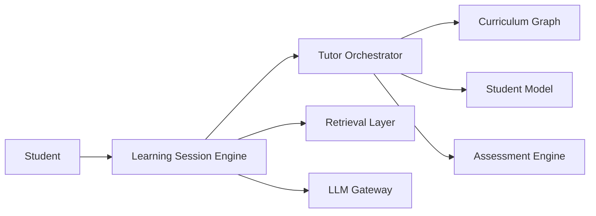

# Deterministic Orchestration Architecture

## Overview

This document defines the deterministic orchestration architecture used by the AIGORA Tutor Orchestrator.

The orchestration system coordinates:

- learning node retrieval
- candidate generation
- deterministic policy execution
- candidate ranking
- orchestration selection

while preserving:

- deterministic guarantees
- orchestration traceability
- auditability
- bounded context isolation
- reproducible pedagogical decisions

The architecture is intentionally deterministic-first and designed to evolve incrementally toward adaptive and hybrid orchestration capabilities.

---

# Architectural Principle

The Tutor Orchestrator acts as the deterministic pedagogical reasoning core of the platform.

Each orchestration stage owns a specific orchestration responsibility.

| Stage | Responsibility |
|---|---|
| Retrieval | Defines what is reachable |
| Candidate Generation | Defines the candidate space |
| Policies | Define what is allowed |
| Ranking | Defines what is preferred |
| Selection | Commits the final orchestration decision |

The orchestration pipeline evolves incrementally while preserving deterministic governance guarantees.

---

# High-Level Orchestration Pipeline

```text
retrieval
↓
candidate generation
↓
policy filtering
↓
ranking
↓
selection
```

---

# Orchestration Component Flow

The orchestration architecture coordinates multiple specialized components.

```text
Tutor Orchestrator
    ↓
Curriculum Graph
    ↓ retrieved nodes

Tutor Orchestrator
    ↓ candidate generation

Tutor Orchestrator
    ↓ policy execution

Tutor Orchestrator
    ↓ ranking

Tutor Orchestrator
    ↓ selection
```

The Tutor Orchestrator coordinates orchestration behavior while specialized components remain responsible for their bounded domains.

---

# High-Level Component Interaction



---

# Orchestration Data Flow

| Stage | Input | Output |
|---|---|---|
| Retrieval | Learning context | Retrieved nodes |
| Candidate Generation | Retrieved nodes | CandidateNode set |
| Policy Filtering | CandidateNode set | Filtered candidates |
| Ranking | Filtered candidates | Ranked candidates |
| Selection | Ranked candidates | Selected node |

The orchestration pipeline transforms topology-valid nodes into deterministic pedagogical decisions.

---

# Pipeline Responsibilities

| Stage | Responsibility | Owner | Deterministic Role | Output |
|---|---|---|---|---|
| Retrieval | Retrieve topology-valid learning nodes | Curriculum Graph | Determine reachability | Retrieved nodes |
| Candidate Generation | Build orchestration-ready candidates | Tutor Orchestrator | Build candidate space | CandidateNode set |
| Policy Filtering | Execute deterministic pedagogical policies | Tutor Orchestrator | Determine allowed candidates | Filtered candidates |
| Ranking | Apply deterministic scoring and ordering | Tutor Orchestrator | Determine candidate preference | Ranked candidates |
| Selection | Select the final learning node | Tutor Orchestrator | Commit orchestration decision | Selected node |

---

# Deterministic Input Boundaries

The deterministic orchestration flow depends on:

- Curriculum Graph version
- Student Model state
- orchestration policies
- ranking strategies
- orchestration configuration
- candidate metadata
- deterministic orchestration sequencing

Changes in any of these inputs may produce different orchestration outputs.

Deterministic orchestration reproducibility depends on preserving stable orchestration inputs.

---

# Decision Engine

The deterministic decision engine coordinates orchestration evaluation and pedagogical decision-making.

## Responsibilities

- policy execution
- ranking strategies
- tie-breaking strategies
- deterministic sequencing
- orchestration contracts
- bounded context enforcement
- deterministic selection guarantees

The decision engine must remain reproducible, auditable, and isolated from infrastructure-specific concerns.

---

# Policy Execution

The orchestration pipeline executes deterministic pedagogical policies such as:

- `EligibilityPolicy`
- `RegressionPolicy`
- `DifficultyPolicy`
- `CompletionPolicy`
- `ReviewPolicy`

Policy execution order must remain:

- deterministic
- reproducible
- stable
- traceable

No orchestration decision may bypass policy evaluation.

---

# Ranking and Selection

Ranking and selection have different orchestration responsibilities.

| Stage | Responsibility |
|---|---|
| Ranking | Creates candidate preference ordering |
| Selection | Commits the final orchestration decision |

Ranking evaluates preference.

Selection commits the final pedagogical decision.

This separation preserves orchestration clarity, bounded governance, and deterministic reproducibility.

---

# Event-Driven Pedagogical Flow

The orchestration lifecycle follows a deterministic event-driven flow.

```text
ExerciseCompleted
↓
AssessmentEvaluated
↓
MasteryEvaluated
↓
StudentModelUpdated
↓
PoliciesExecuted
↓
CandidateRanked
↓
NodeSelected
```

This event sequence guarantees orchestration consistency and reproducible orchestration coordination.

---

# Deterministic Guarantees

The orchestration architecture preserves the following guarantees:

- same input produces the same orchestration output
- deterministic traversal ordering
- deterministic policy execution
- deterministic ranking
- stable tie-breaking
- reproducible node selection
- graph version traceability
- explicit orchestration contracts
- deterministic orchestration sequencing

These guarantees are fundamental for pedagogical consistency and auditability.

---

# Auditability and Decision Traceability

The orchestration system must support complete decision reconstruction.

The architecture preserves:

- policy execution tracing
- ranking trace reconstruction
- selection traceability
- graph version persistence
- candidate scoring traceability
- deterministic orchestration logs
- orchestration decision reproducibility
- event sequencing traceability

Every orchestration decision must be explainable and reconstructable.

---

# Failure Handling

The orchestration pipeline must preserve deterministic behavior under failure conditions.

Possible orchestration failures include:

- graph retrieval failure
- invalid candidate generation
- policy execution failure
- ranking inconsistency
- orchestration timeout
- dependency communication failure
- invalid orchestration contracts

Failures must remain:

- traceable
- reproducible
- observable
- bounded
- auditable

Failure handling must preserve orchestration governance guarantees.

---

# Orchestration vs Execution

The Tutor Orchestrator coordinates pedagogical decisions.

It does not directly execute:

- curriculum traversal
- mastery persistence
- content generation
- learning delivery
- retrieval execution
- language model inference

The orchestrator supervises orchestration flow while specialized components execute their bounded responsibilities.

---

# Interaction Boundaries

The architecture enforces strict interaction boundaries between components.

## Curriculum Graph

- The Tutor Orchestrator must never query Neo4j directly.
- Curriculum Graph owns curriculum topology and traversal behavior.
- Curriculum Graph must never perform pedagogical decisions.

## Tutor Orchestrator

- The Tutor Orchestrator owns orchestration coordination and pedagogical decision flow.
- All orchestration decisions must pass through deterministic policy evaluation.

## LLM Gateway

- LLM interactions must not bypass orchestration policies.
- LLM-generated content must remain governed by orchestration constraints.

## Student Interaction

- Student input must never mutate curriculum topology directly.
- Student-driven interactions must remain mediated through orchestration flows.

These boundaries preserve bounded context isolation and orchestration governance.

---

# Architectural Constraints

The orchestration architecture intentionally separates responsibilities across specialized components.

| Responsibility | Owner |
|---|---|
| Curriculum topology | Curriculum Graph |
| Pedagogical orchestration | Tutor Orchestrator |
| Learning state | Student Model |
| Assessment and mastery evaluation | Assessment Engine |
| Learning session execution | Learning Session Engine |
| Content retrieval | Retrieval Layer |
| Language generation | LLM Gateway |

This separation prevents orchestration logic, infrastructure concerns, and pedagogical rules from becoming tightly coupled.

---

# Non-Goals

The deterministic orchestration architecture does not aim to:

- replace curriculum ownership
- generate unrestricted pedagogical decisions
- bypass deterministic governance
- allow direct topology mutation
- centralize all educational logic inside the orchestrator
- remove bounded context isolation
- bypass orchestration auditability

These non-goals preserve orchestration governance consistency and architectural boundaries.

---

# Operational Orchestration Visibility

The orchestration architecture must preserve operational visibility across all orchestration stages.

The platform must support:

- orchestration runtime sequencing visibility
- orchestration interruption tracking
- asynchronous coordination visibility
- orchestration retry traceability
- orchestration timeout visibility
- deterministic orchestration replay
- distributed orchestration observability

Operational visibility is fundamental for orchestration governance and production-grade orchestration systems.

---

# Future Evolution

The current architecture is deterministic-first.

Future orchestration capabilities may progressively introduce:

- heuristic-assisted ranking
- adaptive orchestration
- AI-assisted recommendation strategies
- probabilistic personalization
- experimentation layers
- semantic orchestration evaluation
- hybrid orchestration pipelines
- distributed orchestration coordination

while preserving:

- deterministic governance guarantees
- orchestration auditability
- bounded context isolation
- architectural traceability
- pedagogical consistency

Deterministic orchestration establishes the governance foundation for future adaptive and AI-assisted orchestration evolution.