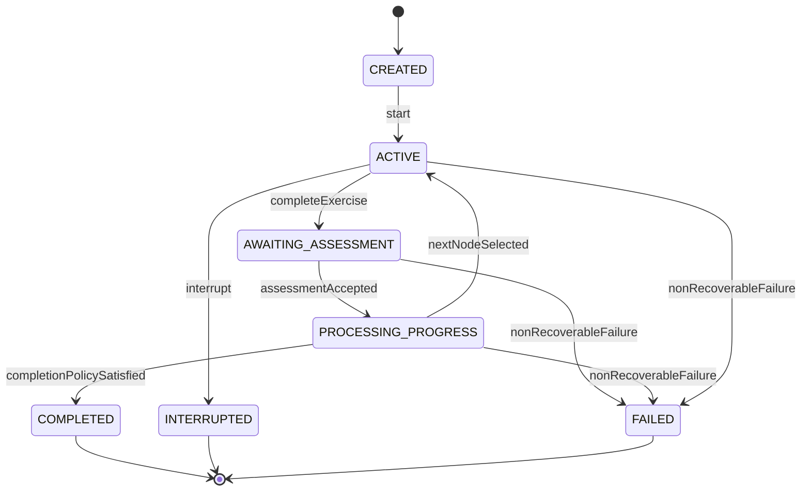
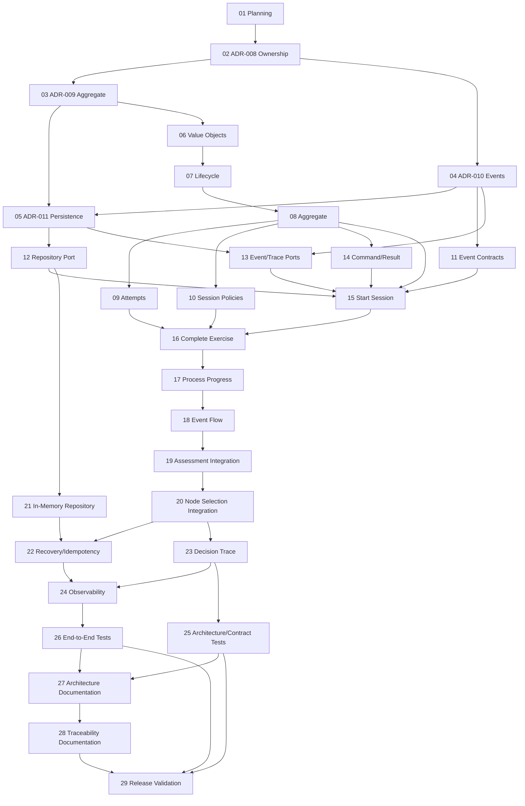

# v0.3.1 — Learning Session Orchestration Release Plan

**Status:** Planning Complete — Implementation Gated by ADR-008 through ADR-011  
**Primary Component:** Tutor Orchestrator  
**Cross-Component Scope:** Learning Session Engine, Assessment Engine, Student Model, Curriculum Graph  
**Root Planning Issue:** GitHub issue #253  
**Target Release:** v0.3.1  
**Planned Date:** 2026-09-18  

---

## 1. Executive Summary

The v0.3.1 release connects the deterministic Tutor Orchestrator core delivered in v0.3.0 to an explicit learning-session lifecycle.

The release does not replace the deterministic decision engine. It introduces the coordination boundary required to:

1. create and track a learning session;
2. associate the current learning node and exercise;
3. receive an exercise attempt;
4. request assessment;
5. process learning-progress signals;
6. execute deterministic policies;
7. reuse candidate generation, ranking, and selection;
8. commit the next session action;
9. preserve complete audit and operational evidence.

The release is decomposed into 29 focused tasks:

- 1 planning task;
- 4 architectural decision tasks;
- 5 domain tasks;
- 4 application contract and port tasks;
- 6 application and orchestration tasks;
- 2 infrastructure and resilience tasks;
- 2 auditability and observability tasks;
- 2 testing tasks;
- 3 documentation and release tasks.

No production implementation should begin until ADR-008 through ADR-011 are approved.

---

## 2. Release Goal

Deliver a deterministic, traceable, recoverable, and testable learning-session orchestration flow that coordinates exercise completion, assessment, learning-progress processing, policy execution, and next-node selection while preserving AIGORA bounded-context ownership.

The milestone is successful when an application-level end-to-end test can prove:

```text
LearningSessionStarted
→ ExerciseCompleted
→ AssessmentEvaluated
→ LearningProgressProcessed
→ PoliciesExecuted
→ CandidateRanked
→ NodeSelected | LearningSessionCompleted
```

with deterministic output, explicit failures, idempotent retries, version-safe persistence, decision traceability, and structured observability.

---

## 3. Architectural Conflict Requiring Resolution

The current architecture assigns:

- **Tutor Orchestrator:** pedagogical decision-making;
- **Learning Session Engine:** learning-session lifecycle, exercise delivery, instructional flow, and user interaction coordination.

The planning issue describes the release as managing a complete session lifecycle “inside the Tutor Orchestrator.”

These two statements are not automatically compatible.

ADR-008 must decide one of the following models:

### Option A — Session aggregate owned by Learning Session Engine

The Learning Session Engine owns session lifecycle state and invokes the Tutor Orchestrator for pedagogical decisions.

**Advantages**

- consistent with the current ownership matrix;
- preserves separation between experience execution and decision-making;
- reduces Tutor Orchestrator responsibility growth.

**Consequences**

- requires an explicit session-to-orchestrator application contract;
- session persistence belongs outside the Tutor Orchestrator;
- some v0.3.1 code may live in a new service/module.

### Option B — Session orchestration subdomain owned by Tutor Orchestrator

The Tutor Orchestrator owns an orchestration-session aggregate, while the Learning Session Engine remains responsible for delivery and interaction.

**Advantages**

- keeps decision progression and its consistency boundary together;
- simplifies the first in-process implementation;
- aligns with the existing Java service implementation target.

**Consequences**

- the aggregate must be named and scoped so it does not absorb delivery responsibilities;
- the ownership and responsibility documents must be updated;
- user interaction and exercise rendering remain external.

### Planning recommendation

Adopt **Option B only if** the aggregate is explicitly defined as a `LearningOrchestrationSession` or equivalent orchestration state, not as the complete learning-experience session.

Otherwise, adopt Option A.

The authoritative decision belongs to ADR-008.

---

## 4. Scope

### 4.1 Mandatory v0.3.1 scope

- session/orchestration-session identity and lifecycle;
- aggregate invariants and legal state transitions;
- exercise attempt completion representation;
- command-result application contracts;
- repository, event, trace, clock, and assessment ports;
- session start use case;
- exercise completion use case;
- post-assessment progress use case;
- event-driven pedagogical flow;
- Assessment Engine integration boundary;
- integration with the existing deterministic decision pipeline;
- in-memory repository adapter;
- idempotency, optimistic concurrency, stale-input detection, and recovery rules;
- complete decision trace;
- structured observability;
- architecture, contract, integration, and end-to-end tests;
- canonical architecture and lifecycle documentation;
- release traceability and final validation.

### 4.2 Optional enhancements

Optional work may be included only if it does not block the mandatory critical path:

- a query use case for reading current session state;
- richer session history projections;
- a durable decision-trace adapter;
- additional fake adapters for demonstrations;
- developer-facing diagnostic tooling.

### 4.3 Explicitly excluded

- full Student Model implementation;
- durable Student Model persistence;
- Assessment Engine scoring implementation;
- distributed event streaming;
- Kafka, RabbitMQ, or another production broker;
- full event sourcing;
- production database adapter unless ADR-011 proves it mandatory;
- HTTP or gRPC delivery endpoints;
- exercise content generation;
- exercise rendering or user-interface delivery;
- Retrieval Layer or LLM Gateway integration unless a mandatory flow requires it;
- probabilistic or LLM-based node selection;
- performance, capacity, and chaos testing beyond release smoke validation.

### 4.4 Future scope

- durable session persistence;
- outbox/inbox patterns;
- distributed workflow execution;
- Student Model Foundation integration from v0.4.0;
- session read models and analytics;
- multi-device continuation;
- long-running session recovery across deployments;
- hybrid deterministic/AI orchestration.

---

## 5. Proposed Lifecycle

The final lifecycle is governed by ADR-009. The planning baseline is:



The exact state names are not implementation commitments. ADR-009 must validate:

- whether `CREATED` and `ACTIVE` are distinct;
- whether exercise presentation requires a separate state;
- whether recoverable failure is a state or an operation result;
- whether interruption belongs to v0.3.1;
- which transitions emit domain events;
- which states are terminal.

---

## 6. Proposed Domain Concepts

### Aggregate and entities

- `LearningSession` or `LearningOrchestrationSession` aggregate root;
- exercise presentation/current exercise reference;
- exercise attempt;
- session progress snapshot or approved progress signal reference.

### Value objects

- `LearningSessionId`;
- `ExerciseId`;
- `AttemptId`;
- `SessionVersion`;
- existing `StudentId`;
- existing `NodeId`;
- existing `CorrelationId`;
- existing `GraphVersion`;
- event and causation identifiers where not already available.

### Domain policies

- session continuation policy;
- session readiness policy;
- terminal completion policy;
- interruption/failure policy if required.

These policies must not duplicate the existing:

- eligibility policy;
- regression policy;
- completion policy used by candidate orchestration;
- candidate ranking and selection rules.

---

## 7. Application Use Cases

### Mandatory

1. `StartLearningSession`
2. `CompleteExercise`
3. `ProcessLearningProgress`

### Supporting behavior

- load and rehydrate session;
- persist session with expected version;
- publish ordered events;
- record decision trace;
- request assessment;
- invoke the existing deterministic decision pipeline;
- apply the selected node or terminal outcome.

### Possible optional use case

- `GetLearningSessionState`

The query use case is optional because the planning issue does not require a delivery API or read model.

---

## 8. Required Ports and Adapters

| Boundary | Port | v0.3.1 Adapter |
|---|---|---|
| Session persistence | `LearningSessionRepository` | In-memory adapter |
| Event publication | `SessionEventPublisher` | Synchronous in-process adapter |
| Decision trace | `DecisionTraceSink` | In-memory/test adapter or existing trace adapter |
| Assessment | Existing/evolved `AssessmentClient` | Deterministic fake adapter |
| Curriculum graph | Existing `CurriculumGraphClient` | Existing fake/gRPC strategy |
| Time | `Clock` abstraction or Java `Clock` injection | Fixed clock in tests |
| Identity | ID generator only if required | Deterministic test generator |
| Decision pipeline | Existing application boundary | Existing deterministic implementation |

No new adapter should be introduced without a use-case dependency.

---

## 9. Event Model

ADR-010 owns the authoritative classification and delivery rules.

### Candidate domain/application events

- `LearningSessionStarted`;
- `ExercisePresented` if presentation is in scope;
- `ExerciseCompleted`;
- `AssessmentRequested`;
- `AssessmentEvaluated`;
- `LearningProgressProcessed` or `MasteryEvaluated`;
- `PoliciesExecuted`;
- `CandidateRanked`;
- `NodeSelected`;
- `LearningSessionCompleted`;
- `LearningSessionInterrupted`;
- `LearningSessionFailed`.

### Required event metadata

- event ID;
- event type;
- schema version;
- occurred-at timestamp;
- session ID;
- correlation ID;
- causation ID;
- graph version where relevant;
- decision ID where relevant.

### Initial delivery strategy

The planning recommendation is:

- synchronous;
- in-process;
- ordered;
- behind an application port;
- at-least-once compatible;
- idempotently processed;
- no external broker.

---

## 10. Consistency, Idempotency, and Recovery

ADR-011 must define the final contract.

The baseline rules are:

1. Session mutation is guarded by an expected `SessionVersion`.
2. Only committed aggregate changes may produce externally published application events.
3. Commands and externally delivered events carry idempotency identities.
4. Duplicate exercise completion cannot create a second committed attempt.
5. Stale assessment results cannot modify the current attempt.
6. Terminal sessions reject mutation.
7. A retry resumes from the last committed boundary.
8. The release must not claim exactly-once delivery.
9. The in-memory adapter proves semantics but does not claim process durability.
10. Decision trace persistence failure must be explicit according to ADR-005.

---

## 11. Error Model

The release must represent at least:

- command validation failure;
- session not found;
- session already exists;
- invalid lifecycle transition;
- attempt not found;
- attempt already completed;
- session version conflict;
- stale or mismatched assessment;
- graph version mismatch;
- no eligible candidate;
- assessment timeout;
- assessment unavailable;
- malformed dependency response;
- event publication failure;
- decision-trace recording failure;
- non-recoverable session failure.

Errors must map to typed command-result outcomes and must not require callers to parse exception messages.

---

## 12. Observability and Auditability

### Decision trace

The canonical pedagogical trace must preserve:

- session, event, attempt, graph, correlation, causation, and decision IDs;
- assessment summary approved for audit;
- policy execution and reason codes;
- candidate set;
- deterministic ranking evidence;
- selected node or terminal outcome;
- lifecycle transitions;
- fallback and failure decisions;
- timestamps and component versions where required.

### Technical observability

Structured technical telemetry must include:

- stage duration;
- success/failure outcome;
- invalid transition;
- duplicate/deduplicated operation;
- version conflict;
- dependency timeout/unavailability;
- event publication result;
- trace recording result.

Technical logs are not the canonical pedagogical decision trace.

Sensitive learner responses must not be copied into logs or traces unless explicitly approved.

---

## 13. Testing Strategy

### Unit tests

- value-object validation;
- state-transition matrix;
- aggregate invariants;
- attempt lifecycle;
- session policies;
- event and command contract validation.

### Contract tests

- repository semantics;
- event envelope invariants;
- Assessment Client request/response behavior;
- command-result variants.

### Architecture tests

- domain has no Spring, persistence, transport, or infrastructure dependency;
- application depends on ports;
- adapters implement ports;
- package direction follows ADR-006;
- command-result contracts follow ADR-007.

### Integration tests

- start session with in-memory repository;
- complete exercise and publish event;
- process assessment;
- invoke deterministic decision pipeline;
- apply selected node;
- record trace.

### End-to-end application tests

- continuing-session happy path;
- terminal completion;
- remediation/regression where supported;
- no eligible candidate;
- duplicate completion;
- stale assessment;
- version conflict;
- timeout/unavailable dependency;
- retry and recovery;
- trace reconstruction.

---

## 14. Documentation Impact

### New canonical document

- `docs/02-architecture/learning-session-engine.md`

### Documents requiring review/update

- `docs/02-architecture/overview.md`
- `docs/02-architecture/tutor-orchestrator/index.md`
- `docs/02-architecture/tutor-orchestrator/glossary.md`
- `docs/02-architecture/tutor-orchestrator/01-overview/architecture-overview.md`
- `docs/02-architecture/tutor-orchestrator/01-overview/architecture-map.md`
- `docs/02-architecture/tutor-orchestrator/01-overview/interaction-model.md`
- `docs/02-architecture/tutor-orchestrator/02-orchestration/event-driven-pedagogical-flow.md`
- `docs/02-architecture/tutor-orchestrator/03-decision-engine/decision-lifecycle.md`
- `docs/02-architecture/tutor-orchestrator/05-governance/component-ownership.md`
- `docs/02-architecture/tutor-orchestrator/05-governance/responsibility-matrix.md`
- `docs/02-architecture/tutor-orchestrator/05-governance/architectural-responsibility-boundaries.md`
- `docs/02-architecture/tutor-orchestrator/05-governance/auditability-and-decision-traceability.md`
- `docs/02-architecture/tutor-orchestrator/05-governance/observability-strategy.md`
- `docs/02-architecture/tutor-orchestrator/07-java-architecture/domain-model.md`
- `docs/02-architecture/tutor-orchestrator/07-java-architecture/use-cases.md`
- `docs/02-architecture/tutor-orchestrator/07-java-architecture/application-contracts.md`
- `docs/02-architecture/tutor-orchestrator/07-java-architecture/ports-and-adapters.md`
- `docs/02-architecture/tutor-orchestrator/07-java-architecture/error-model.md`
- `docs/02-architecture/tutor-orchestrator/07-java-architecture/testing-strategy.md`
- `docs/06-engineering/governance/release-roadmap.md`
- `docs/06-engineering/governance/traceability-model.md`

---

## 15. ADR Plan

| ADR | Decision | Blocks |
|---|---|---|
| ADR-008 | Learning Session ownership and bounded-context boundaries | All domain and implementation work |
| ADR-009 | Learning Session aggregate and lifecycle model | Domain, commands, use cases |
| ADR-010 | Event publication and consistency boundaries | Events, handlers, trace, orchestration |
| ADR-011 | Persistence and recovery strategy | Repository, idempotency, recovery |

Existing governing ADRs:

- ADR-001 — Deterministic-First Orchestration;
- ADR-003 — Decision Engine Decomposition;
- ADR-004 — Event-Driven Pedagogical Flow;
- ADR-005 — Auditability-First Architecture;
- ADR-006 — Java Layered Architecture;
- ADR-007 — Command-Result Application Contracts.

---

## 16. Task Inventory

| ID | Area | Task |
|---:|---|---|
| 01 | Planning | Plan the v0.3.1 release |
| 02 | ADR | Define ownership and bounded-context boundaries |
| 03 | ADR | Define aggregate and lifecycle model |
| 04 | ADR | Define event publication and consistency boundaries |
| 05 | ADR | Define persistence and recovery strategy |
| 06 | Domain | Implement identity and lifecycle value objects |
| 07 | Domain | Implement status and transition model |
| 08 | Domain | Implement the Learning Session aggregate |
| 09 | Domain | Implement exercise attempt and completion models |
| 10 | Domain | Implement session progress and completion policies |
| 11 | Application | Define event contracts |
| 12 | Application | Define repository port |
| 13 | Application | Define event and decision-trace ports |
| 14 | Application | Define command and result contracts |
| 15 | Application | Implement Start Learning Session |
| 16 | Application | Implement Complete Exercise |
| 17 | Application | Implement Process Learning Progress |
| 18 | Orchestration | Implement event-driven pedagogical flow |
| 19 | Integration | Integrate Assessment Engine |
| 20 | Orchestration | Integrate deterministic node selection |
| 21 | Infrastructure | Implement in-memory repository |
| 22 | Application | Implement recovery, idempotency, and concurrency safeguards |
| 23 | Auditability | Implement session decision trace |
| 24 | Observability | Add structured lifecycle observability |
| 25 | Testing | Add architecture and contract tests |
| 26 | Testing | Add end-to-end lifecycle tests |
| 27 | Documentation | Document Learning Session architecture |
| 28 | Documentation | Update Orchestrator docs and traceability |
| 29 | Release | Validate and close v0.3.1 |

The detailed issue descriptions are maintained in the separate issue package.

---

## 17. Dependency Graph



The graph is acyclic.

---

## 18. Critical Path

```text
01 → 02 → 03 → 06 → 07 → 08 → 09 → 14 → 15 → 16 → 17
→ 18 → 19 → 20 → 23 → 24 → 26 → 27 → 28 → 29
```

The primary schedule risk is not Java implementation complexity. It is delayed resolution of ownership, aggregate, event-consistency, and persistence decisions.

---

## 19. Parallelization Plan

### After Task 02

- Task 03 — aggregate/lifecycle ADR;
- Task 04 — event/consistency ADR.

### After ADR approval

- Task 06 — value objects;
- Task 11 — event contracts;
- Task 12 — repository port;
- Task 13 — event/trace ports;
- Task 14 — command/result contracts.

Task 08 still requires Tasks 06 and 07.

### After aggregate stabilization

- Task 09 — attempt models;
- Task 10 — session policies;
- Task 21 — in-memory repository;
- early Task 25 architecture rules.

### Late release

- Task 23 — trace generation;
- Task 24 — observability;
- Task 25 — architecture/contract tests;
- Task 26 — end-to-end tests.

Final completion remains sequential through Tasks 27, 28, and 29.

---

## 20. Milestone Gates

### Gate A — Architecture Ready

Required:

- Tasks 02–05 complete;
- ADR-008 through ADR-011 accepted;
- ownership conflict resolved;
- aggregate and lifecycle approved;
- event and persistence semantics approved.

### Gate B — Domain Ready

Required:

- Tasks 06–10 complete;
- aggregate invariants tested;
- state-transition matrix tested;
- no framework dependency in domain.

### Gate C — Application Flow Ready

Required:

- Tasks 11–22 complete;
- happy-path flow works with controlled adapters;
- concurrency and idempotency safeguards proven.

### Gate D — Production-Quality Evidence Ready

Required:

- Tasks 23–26 complete;
- trace reconstruction works;
- technical telemetry exists;
- architecture, contract, and end-to-end tests pass.

### Gate E — Release Ready

Required:

- Tasks 27–29 complete;
- documentation matches implementation;
- traceability complete;
- changelog and release notes prepared;
- no unresolved critical architectural gap.

---

## 21. Risks and Mitigations

| Risk | Impact | Mitigation |
|---|---|---|
| Ownership conflict remains unresolved | Blocks entire release | Complete ADR-008 before domain implementation |
| Session aggregate absorbs delivery/UI concerns | Boundary erosion | Explicit non-responsibilities in ADR-008/009 |
| Event flow becomes an implicit chain of callbacks | Poor recovery and traceability | ADR-010 ordered handlers and typed outcomes |
| Publish-after-save failure creates inconsistency | Partial flow | Decide commit/publish semantics in ADR-010/011 |
| Duplicate assessment advances session twice | Corrupted learning progression | Event identity, attempt identity, version checks |
| Student Model scope leaks into v0.3.1 | Release expansion | Use explicit external contract/fake; defer persistence to v0.4.0 |
| Decision pipeline is duplicated in session code | Divergent behavior | Task 20 must reuse v0.3.0 components |
| In-memory adapter is mistaken for durability | False operational guarantees | Explicit limitation in ADR-011 and docs |
| Decision trace stores sensitive learner content | Privacy/security risk | Data minimization and redaction requirements |
| Metrics use IDs as labels | Cardinality explosion | IDs only in logs/traces, not metric labels |
| Tasks use planning IDs after GitHub creation | Broken traceability | Replace Task IDs with real issue numbers |

---

## 22. Definition of Planning Complete

This release planning activity is complete when:

- the scope and non-goals are documented;
- the ownership conflict is explicit and assigned to ADR-008;
- required ADRs are identified;
- domain concepts, use cases, ports, adapters, events, policies, integrations, errors, tests, and documents are identified;
- 29 focused tasks exist;
- dependencies form an acyclic graph;
- critical path and parallel work are documented;
- milestone gates and risks are documented;
- implementation can begin with Task 02 without additional high-level decomposition.

The release itself is not implementation-ready until ADR-008 through ADR-011 are accepted.
