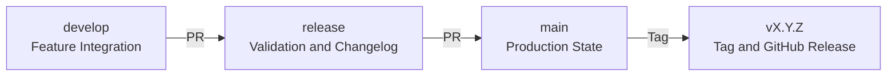

# Release Process

## Overview

This document defines the standardized release process for the AIGORA project,
including branching strategy, versioning, and release publication workflow.

---

## Branch Flow

The project follows a structured release flow:
develop → release → main

- `develop`: active development
- `release`: stabilization and changelog finalization
- `main`: production-ready state (source of truth for releases)

---

## Release Steps

1. Merge approved work into `develop`
2. Open a Pull Request from `develop` to `release`
3. Validate documentation, structure, and CI checks
4. Generate and review the CHANGELOG.md (see [Changelog Generation](#changelog-generation))
5. Open a Pull Request from `release` to `main`
6. Merge into `main`
7. Create a version tag on `main`
8. Publish the GitHub release

---

## Release Flow Diagram



---

## Example Workflow

Below is a typical release workflow:

```
feature/docs-x → develop
feature/docs-y → develop

develop → release

release:
  generate and review CHANGELOG.md
  finalize documentation

release → main

main:
  create tag (e.g., v0.1.0)
```

This flow ensures that:

- all changes are consolidated in `develop`
- the `release` branch is used for final adjustments (changelog and documentation)
- the `main` branch always reflects the final, production-ready state
- tags are created only from `main`

---

## Versioning

The project follows **Semantic Versioning**: **MAJOR.MINOR.PATCH**

### Meaning
- **MAJOR**: breaking changes
- **MINOR**: new compatible features
- **PATCH**: fixes and minor improvements

### Examples
- `v1.0.0` → first stable release
- `v1.1.0` → new feature added without breaking existing behavior
- `v1.1.1` → bug fix or small improvement

### Pre-1.0 Rules
While the project is in early stages:

- `v0.1.0` → initial architecture foundation
- `v0.2.0` → new core component introduced
- `v0.2.1` → documentation fix or minor update

---

## Changelog Generation

CHANGELOG.md is generated using `tools/changelog_generator/cli.py`, which parses
Commits following the Conventional Commits format and groups them by type.

### Commit-to-Section Mapping

| Commit type | Changelog section |
|---|---|
| `feat` | Added |
| `fix` | Fixed |
| `refactor`, `perf`, `ci`, `build`, `docs` | Changed |
| `revert` | Removed |
| Any type with `!` | Breaking |

Non-conventional commits are excluded. See [Commit Convention](../conventions/commits.md).

### CI Previews

The `changelog-check` workflow runs automatically and posts dry-run output:

- **PR to `develop`**: previews what that PR contributes relative to `develop`
- **Push to `release`**: previews what `release` has relative to `main`

Output appears in the workflow logs. On PRs to `develop`, a summary comment is posted.
No files are modified — these are previews only.

### Generating the Changelog Locally

Run from `tools/changelog_generator/`:

```bash
# Preview (dry-run)
python3 cli.py --version v0.2.0 --rev-range main..release --dry-run

# Commit to CHANGELOG.md
python3 cli.py --version v0.2.0 --rev-range main..release

# Auto-detect version from last tag
python3 cli.py --version auto --rev-range main..release
```

The `--version auto` flag increments the patch number from the latest tag.

### Handling Late-Arriving PRs

If a PR merges into `release` after the CHANGELOG was generated, re-run the
generation locally:

```bash
python3 tools/changelog_generator/cli.py \
  --version v0.2.0 \
  --rev-range main..release
```

This overwrites the previous entry for that version.

---

## Release Preparation

The `CHANGELOG.md` file is automatically finalized in the `release` branch before
merging the Pull Request from `release` to `main`.

The `main` branch must always reflect the final state of the release,
including:

- updated `CHANGELOG.md` (automatically generated)
- finalized documentation
- release-ready content

After merging into `main`, no additional changes related to the release
(e.g., changelog updates or documentation fixes) should be introduced.

---

## Rules

- Tags must be created from the `main` branch only
- Releases must not be created from `dev` or `release`
- All release notes must follow the standard template
- **CHANGELOG.md is automatically generated** from commits using Conventional Commits
- All commits must follow the Conventional Commits format for proper changelog generation
- No release-related changes must be made directly on `main`

---

## Release Notes

All releases must include structured release notes.

A template is available at:

- [Release Notes Template](../../../.github/ISSUE_TEMPLATE/release.md)

This ensures consistency and readability across releases.

---

## How to Create a Release

1. Navigate to the [GitHub Releases](https://github.com/AigoraCorporation/aigora/releases) page
2. Create a new release using a valid tag (e.g., `v0.1.0`)
3. Copy the template from:
   - [Release Notes Template](../../../.github/ISSUE_TEMPLATE/release.md)
4. Fill in all relevant sections
5. Ensure consistency with:
   - [CHANGELOG.md](../../../CHANGELOG.md)
6. Publish the release

---

## Changelog

All changes must be recorded in:

- [CHANGELOG.md](../../../CHANGELOG.md)

The changelog is the **single source of truth** for all project changes.

Each release must:

- be documented in the changelog
- match the published GitHub release notes


