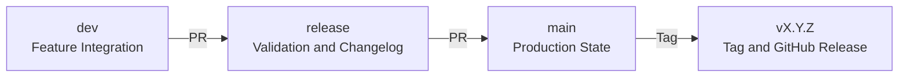

# Release Process

## Overview

This document defines the standardized release process for the AIGORA project,
including branching strategy, versioning, and release publication workflow.

---

## Branch Flow

The project follows a structured release flow:
dev → release → main

- `dev`: active development
- `release`: stabilization and validation
- `main`: production-ready state (source of truth for releases)

---

## Release Steps

1. Merge approved work into `dev`
2. Open a Pull Request from `dev` to `release`
3. Validate documentation, structure, and CI checks
4. Open a Pull Request from `release` to `main`
5. Merge into `main`
6. Create a version tag on `main`
7. Publish the GitHub release
8. Update `CHANGELOG.md`

---

## Release Flow Diagram



---

## Example Workflow

Below is a typical release workflow:

```
feature/docs-x → dev
feature/docs-y → dev

dev → release

release:
  update CHANGELOG.md
  finalize documentation

release → main

main:
  create tag (e.g., v0.1.0)
```

This flow ensures that:

- all changes are consolidated in `dev`
- the `release` branch is used for final adjustments (e.g., changelog and documentation)
- the `main` branch always reflects the final, production-ready state
- tags are created only from `main`

---

## Versioning

The project follows **Semantic Versioning**: **MAJOR.MINOR.PATCH**

### Meaning
- **MAJOR**: breaking changes
- **MINOR**: new compatible features
- **PATCH**: fixes and minor improvements

### Examples
- `v1.0.0` → first stable release
- `v1.1.0` → new feature added without breaking existing behavior
- `v1.1.1` → bug fix or small improvement

### Pre-1.0 Rules
While the project is in early stages:

- `v0.1.0` → initial architecture foundation
- `v0.2.0` → new core component introduced
- `v0.2.1` → documentation fix or minor update

---

## Release Preparation

The `CHANGELOG.md` file must be finalized in the `release` branch before
merging the Pull Request from `release` to `main`.

The `main` branch must always reflect the final state of the release,
including:

- updated `CHANGELOG.md`
- finalized documentation
- release-ready content

After merging into `main`, no additional changes related to the release
(e.g., changelog updates or documentation fixes) should be introduced.

---

## Rules

- Tags must be created from the `main` branch only
- Releases must not be created from `dev` or `release`
- All release notes must follow the standard template
- `CHANGELOG.md` must be updated before publishing a release
- No release-related changes must be made directly on `main`

---

## Release Notes

All releases must include structured release notes.

A template is available at:

- [Release Notes Template](../../.github/release-template.md)

This ensures consistency and readability across releases.

---

## How to Create a Release

1. Navigate to the [GitHub Releases](https://github.com/AigoraCorporation/aigora/releases) page
2. Create a new release using a valid tag (e.g., `v0.1.0`)
3. Copy the template from:
   - [Release Notes Template](../../.github/release-template.md)
4. Fill in all relevant sections
5. Ensure consistency with:
   - [CHANGELOG.md](../../CHANGELOG.md)
6. Publish the release

---

## Changelog

All changes must be recorded in:

- [CHANGELOG.md](../../CHANGELOG.md)

The changelog is the **single source of truth** for all project changes.

Each release must:

- be documented in the changelog
- match the published GitHub release notes


